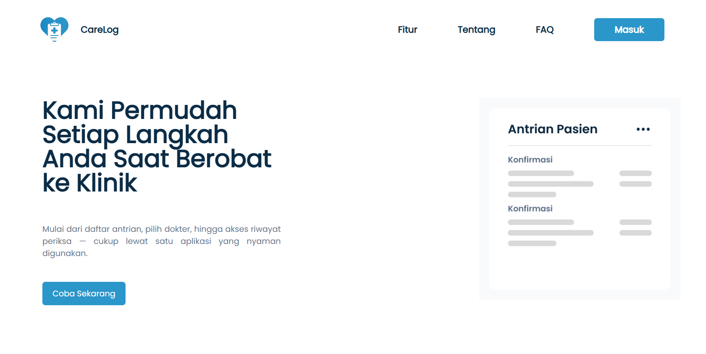
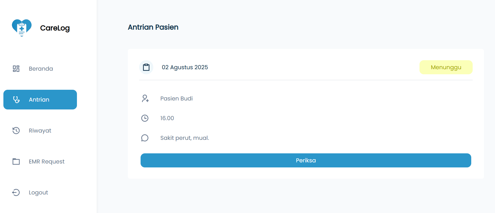

# 🏥 CareLog

Web application for managing electronic medical records. Doctors can review patient histories, add notes, and prescribe treatments. Patients can securely access their medical records, prescriptions, and appointments anytime, anywhere.

---

## ✨ Features

- 👨‍⚕️ **Doctor Dashboard**
  Manage patient records, view medical histories, approve access requests, and write prescriptions.

- 👩‍💻 **Patient Portal**
  View personal medical history, access approved electronic medical records (EMR), and download prescription PDFs.

- 📅 **Appointment Scheduling**
  Patients can take queue numbers and schedule visits; doctors can see upcoming appointments.

- 🔐 **Secure Access Control**
  Patients must request access to their medical records; doctors can review and approve access to ensure privacy.

- 📄 **EMR Viewer & Prescription PDF Download**
  Patients and doctors can view structured EMR entries, and download printable PDF versions of prescriptions for offline use or pharmacy submission.

---

## 📸 Previews

### 🏠 Landing Page

### 👩‍💻 Patient Dashboard

### 👨‍⚕️ Doctor Dashboard

### 📝 Medical Record Access Request
